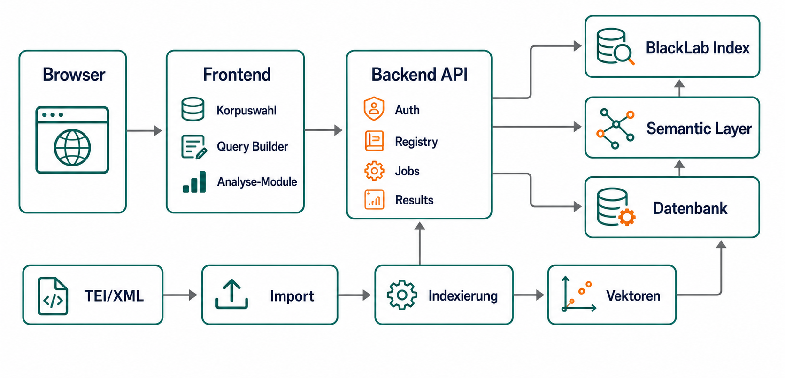
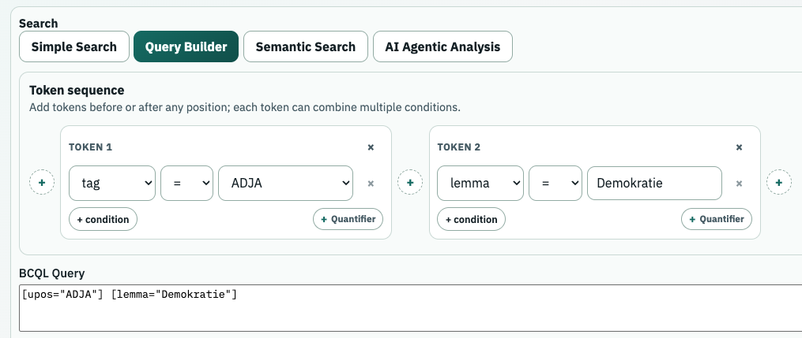
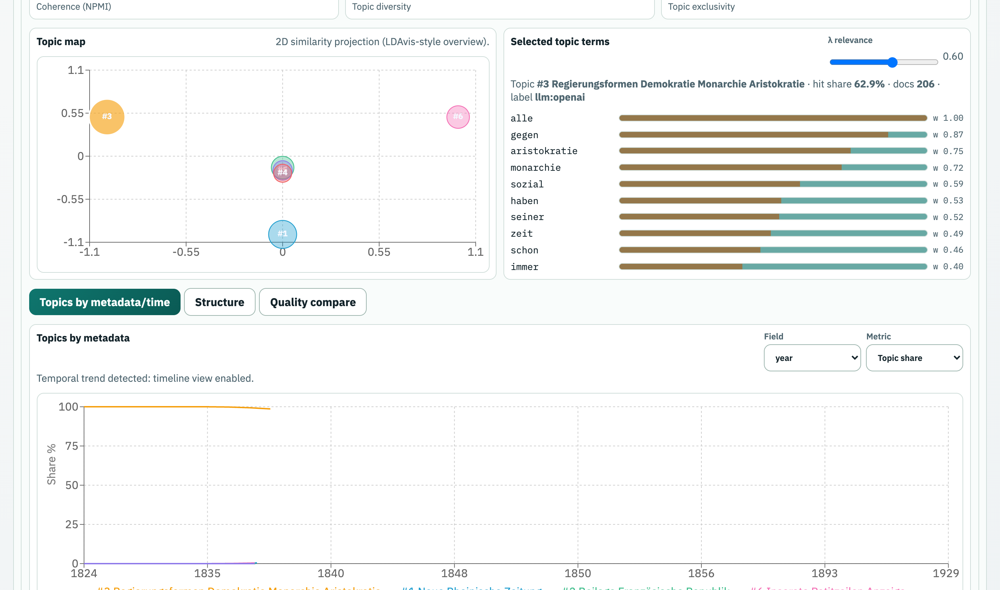
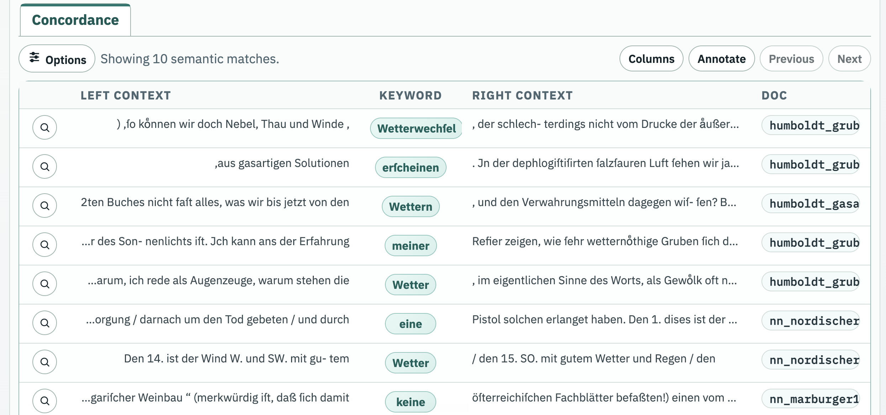
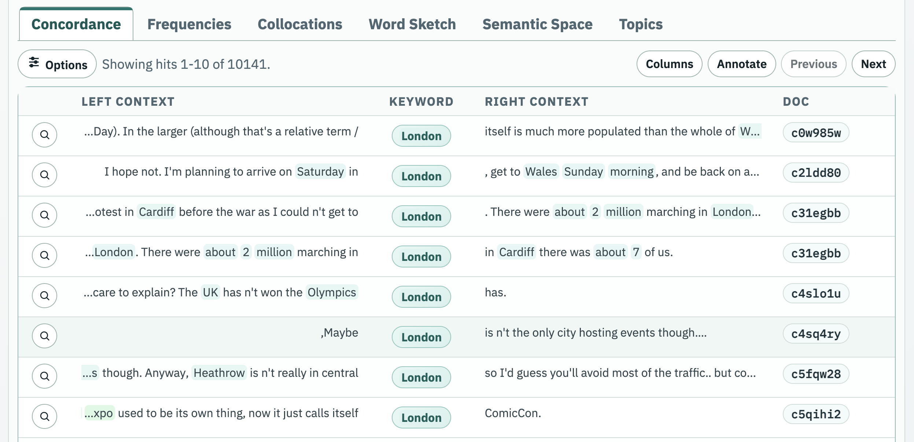
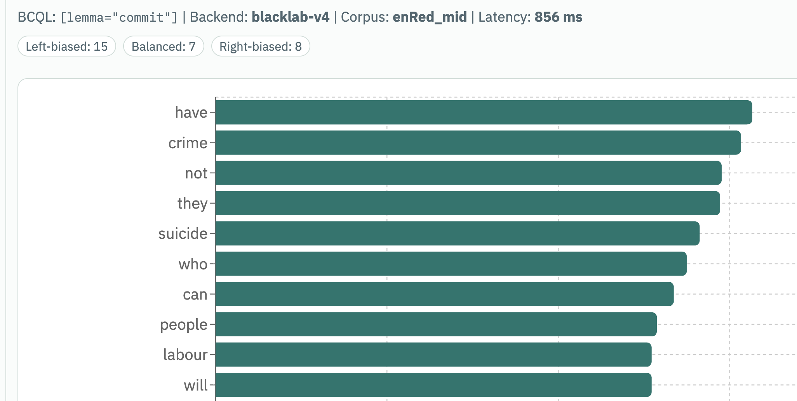
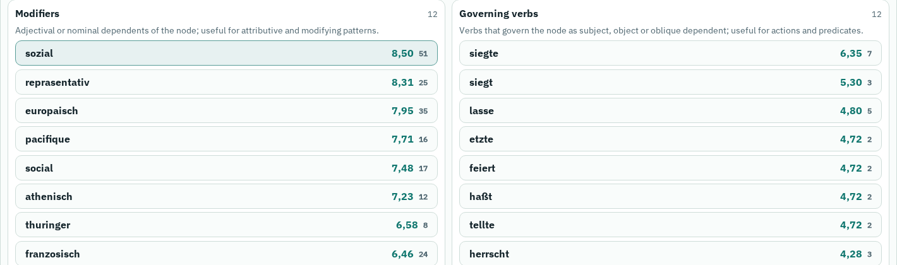
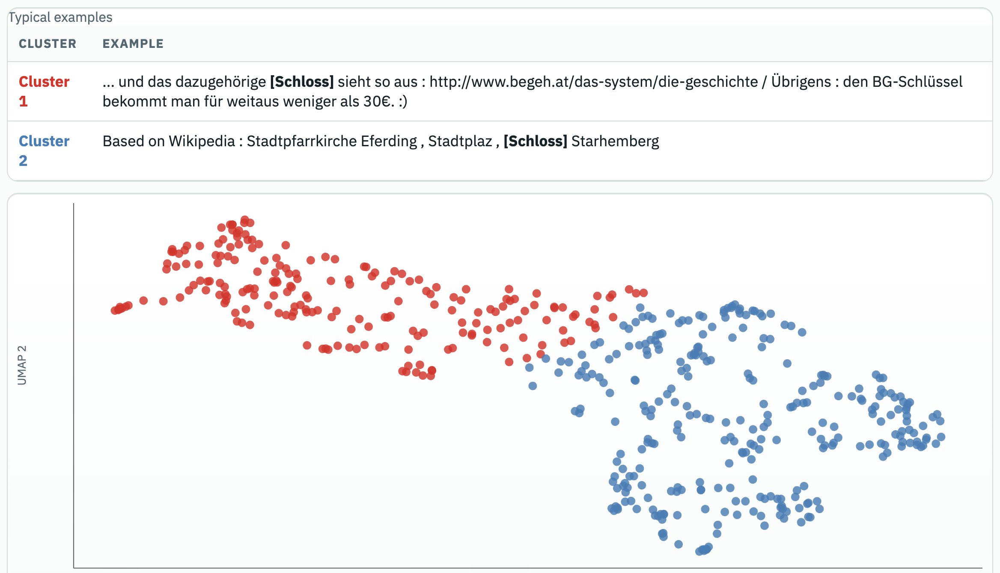
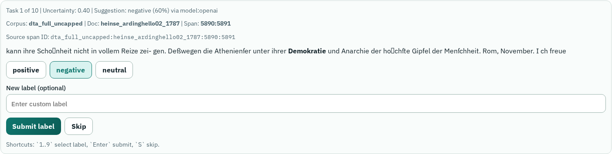
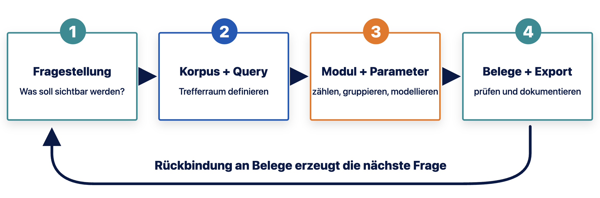

## TextLab in den Digital Humanities {#title-slide .custom-title-slide background-color="#eef4f8"}


<div class="title-subtitle">Ringvorlesung Digital Humanities · LMU · Sommersemester 2026</div>

<div class="title-author">Quirin Würschinger · LMU München · 11. Mai 2026</div>

<div class="title-email">q.wuerschinger@lmu.de</div>

<div class="title-access">
  
  <a href="https://textlab.short.gy/vldh">textlab.short.gy/vldh</a>
</div>

## Einstieg


::: {.question-pair}
::: {.question-card}
**TextLab**

TextLab macht große Textsammlungen praktisch untersuchbar: als Belege, Verteilungen, Nachbarschaften, semantische Räume und Labels.
:::

::: {.question-card}
**DH-Perspektive**

Interessant ist nicht nur das Ergebnis, sondern auch die Frage: Wie baut man so ein Tool?
:::
:::

::: {.callout-fragment}
Wir nutzen TextLab doppelt: als Werkzeug für Beispiele und als Fallstudie für DH-Software.
:::

## Was TextLab als Operationen anbietet


::: {.demo-palette}
::: {.demo-card}
**Belege öffnen**<br>
KWIC, Kontext, Dokumentdetails.
:::

::: {.demo-card}
**Verteilungen sehen**<br>
Jahr, Genre, Subreddit, Texttyp.
:::

::: {.demo-card}
**Nachbarschaften finden**<br>
Kollokationen und Beispielkontexte.
:::

::: {.demo-card}
**Grammatische Profile bauen**<br>
Word Sketches aus Annotationen.
:::

::: {.demo-card}
**Semantisch explorieren**<br>
Embeddings, Cluster, Search.
:::

::: {.demo-card}
**Treffer annotieren**<br>
LLM Classification, Review, Export.
:::
:::

::: {.callout-fragment}
Leitmotiv: Jede Operation ist ein Methodenangebot und zugleich eine technische Architekturentscheidung.
:::

## Jede Methode hat drei Schichten


::: {.method-detail}
::: {.detail-panel}
<div class="panel-title">Daten</div>

Welche Einheiten gibt es: Dokument, Satz, Token, Treffer, Metadatum, Annotation, Vektor, Label?
:::

::: {.detail-panel}
<div class="panel-title">Methode</div>

Wie wird daraus ein Ergebnis: Indexsuche, Gruppierung, Fensterzählung, Dependency-Mapping, Vektorvergleich?
:::

::: {.example-panel}
<div class="panel-title">Interface</div>

Welche kontrollierbare Handlung entsteht daraus: Query bauen, Treffer lesen, Parameter setzen, Ergebnis prüfen?
:::
:::

::: {.caption-note}
Das ist auch für DH-Programmierung relevant: Methode, Datenmodell und Softwaredesign sind hier nicht getrennt; vgl. @schoch2013; @drucker2011.
:::

## Architektur der App


<div class="architecture-diagram-slide">

</div>

::: {.caption-note}
Die zentrale Designidee: Einmal sauber kompilierte Korpora tragen viele Analyseoperationen; die Backend-API vermittelt zwischen UI, Index, Datenbank, Jobs und semantischen Schichten.
:::

## TextLab als Software-System


::: {.pipeline-flow}
::: {.pipeline-step}
**Frontend · React**

Korpusauswahl, Query Builder, Ergebnisansichten, Module, Settings.
:::

::: {.pipeline-step}
**Backend · FastAPI**

Schema, Suche, Frequenzen, Jobs, Annotation, KI-Workflows.
:::

::: {.pipeline-step}
**BlackLab**

BCQL, Tokenpositionen, KWIC-Kontext, Gruppierungen.
:::

::: {.pipeline-step}
**Registry & Jobs**

Korpuswissen, Embeddings, Topics, LLM-Klassifikation, Exporte.
:::
:::

::: {.caption-note}
Viele UI-Aktionen sind kleine Pipelines: Input validieren, API-Request bauen, Index oder Job ausführen, Resultat in eine lesbare Form bringen.
:::

## Corpus Registry: Korpuswissen als Konfiguration


::: {.translation-strip}
::: {.translation-step}
**Index**

BlackLab weiß, welche Felder technisch vorhanden sind.
:::

::: {.translation-step}
**Registry**

TextLab weiß, was Felder bedeuten, welche Werte wichtig sind und welche Module sinnvoll sind.
:::

::: {.translation-step}
**UI**

Query Builder, Korpusauswahl und Filter bekommen dieselben Informationen.
:::

::: {.translation-step .is-dark}
**QA**

Docs und Tests können gegen dieselbe Quelle prüfen.
:::
:::

## Registry als Schnittstelle


```yaml
coha:
  total_tokens: 472302948
  annotations:
    attributes: [word, lemma, tag]
  metadata_fields:
    - { key: year, label: Year }
    - { key: genre, label: Genre }
  value_options:
    annotations:
      tag: [nn1, jj, vv0, "..."]
    metadata:
      genre: [FIC, MAG, NEWS, NF]
```

::: {.syntax-reference}
Ausschnitt aus `server/corpora.yml`: Die App behandelt Korpuswissen als Konfiguration → single source of truth.
:::

## Korpuslinguistik


::: {.corpus-basics}
::: {.corpus-terms}
::: {.corpus-term}
<div class="panel-title">Korpus</div>

Eine dokumentierte, maschinenlesbare Textsammlung mit Auswahlkriterien und Metadaten.
:::

::: {.corpus-term}
<div class="panel-title">Annotation</div>

Zusätzliche Schichten über dem Text: Token, Lemma, Wortart, syntaktische Relation, Entität.
:::

::: {.corpus-term}
<div class="panel-title">Trefferraum</div>

Eine Query erzeugt nicht einfach “die Antwort”, sondern eine Menge von Treffern, die weiter analysiert wird.
:::
:::

::: {.corpus-why}
::: {.corpus-why-item}
**Empirie**

Korpora machen viele authentische Belege systematisch zugänglich.
:::

::: {.corpus-why-item}
**Variation**

Zeit, Genre, Register, Region oder Community werden vergleichbar.
:::

::: {.corpus-why-item}
**Operationalisierung**

Begriffe werden zu Suchmustern, Trefferräumen und kontrollierbaren Aggregationen.
:::
:::
:::

::: {.caption-note}
Korpuslinguistische Grundlagen: @sinclair1991; @biberConradReppen1998; @hunston2002; @mceneryHardie2011.
:::

## Text wird zur Datenstruktur


::: {.tei-index-grid}
::: {.tei-note}
```xml
<TEI>
  <teiHeader>
    <titleStmt>
      <title>Die Freiheit bleibt umkämpft</title>
    </titleStmt>
    <profileDesc>
      <creation><date when="1848"/></creation>
    </profileDesc>
  </teiHeader>
  <text>
    <body>
      <p>Die Freiheit bleibt umkämpft.</p>
    </body>
  </text>
</TEI>
```

::: {.syntax-reference}
TEI/XML beschreibt Text, Struktur und Metadaten. Für die Suche wird daraus ein Tokenstrom mit Annotationen.
:::
:::

::: {.tei-note}
| pos | word | lemma | pos_tag | dep_rel | metadata |
|---:|---|---|---|---|---|
| 1 | Die | die | ART | nk | year=1848 |
| 2 | Freiheit | Freiheit | NN | sb | year=1848 |
| 3 | bleibt | bleiben | VVFIN | root | year=1848 |
| 4 | umkämpft | umkämpfen | ADJD | pd | year=1848 |

::: {.syntax-reference}
Korpussuche heißt: über Wortform, Lemma, Wortart, syntaktische Relation oder Metadaten filtern.
:::
:::
:::

## Grundoperationen


::: {.workflow .core-workflow}
::: {.workflow-step}
**Query**

Korpus, Tokenattribute und Filter definieren den Suchraum.
:::

::: {.workflow-step}
**KWIC**

Treffer werden mit linkem und rechtem Kontext lesbar.
:::

::: {.workflow-step}
**Frequency**

Treffer werden nach Annotationen oder Metadaten gruppiert.
:::

::: {.workflow-step}
**Collocations & Word Sketches**

Nachbarwörter werden gezählt und bewertet.
:::

::: {.workflow-step .is-dark}
**Modeling**

Embeddings, Topics oder LLM-Labels ergänzen die Suchlogik.
:::
:::

## Operationalisierung


::: {.operationalization-grid}
::: {.concept-box}
**Konzept**

Ein Begriff, ein Muster, eine historische Frage oder ein Vergleichsinteresse.
:::

::: {.arrow-box}
→
:::

::: {.query-box}
**Query**

`[lemma="Demokratie"]`

Das ist ein Suchweg, nicht der Begriff selbst.
:::

::: {.arrow-box}
→
:::

::: {.evidence-box}
**Trefferraum**

KWIC-Zeilen, Frequenzen, Jahre, Genres, Communities, Kollokationen.
:::
:::

## Daten im TextLab


::: {.corpus-table}
| Korpus | Größe | Stärken für die Demo | Typische Frage |
|---|---:|---|---|
| English Reddit | 41.3M Tokens | regionale Communities, Variation im Englischen | Welche Themen und Wörter markieren Regionen? |
| German Reddit | 61.2M Tokens | Gegenwartssprache, Subreddits, Plattformkommunikation | Wie unterscheiden sich Communities? |
| DTA | 238.3M Tokens | historisches Deutsch, Jahresmetadaten, stabile Belegarbeit | Wie verschieben sich politische Begriffe? |
| COHA | ca. 470M Tokens | historisches Englisch, Genres, 1820-2019 | Wie verändert sich Wortgebrauch über Dekaden? |
:::

::: {.caption-note}
COHA als diachrones Referenzkorpus: @davies2012coha.
:::


## Drei ausgewählte Korpora


::: {.tool-facts}
::: {.tool-fact}
**DTA**

Kanonisierte historische Texte, lange Dokumente, gute Zeitachse. 

Beispiel: `[lemma="Demokratie"]` nach `year`.
:::

::: {.tool-fact}
**Reddit**

Viele kurze Dokumente, soziale Plattformmetadaten, Community-Struktur. 

Beispiel: *Servus*, *Oida*, *wos* nach `subreddit`.
:::

::: {.tool-fact}
**COHA**

Historisches Englisch, Genre- und Dekadenvergleich. 

Beispiel: *computer*, *radio*, *telephone* nach `decade`.
:::
:::

::: {.callout-fragment}
Die Korpuslogik entscheidet mit, welche Methoden gut funktionieren und welche Beispiele überzeugend sind.
:::

## Korpuskompilierung


::: {.workflow}
::: {.workflow-step}
**1 Auswahl**

Zeitraum, Sprache, Quelle, Rechte, Sampling.
:::

::: {.workflow-step}
**2 Dokumentmodell**

Was ist ein Dokument, was ist ein Chunk, was bleibt Metadatum?
:::

::: {.workflow-step}
**3 Normalisierung**

Text reinigen, strukturieren, persistieren.
:::

::: {.workflow-step}
**4 NLP**

Tokenisierung, Lemma, POS, Dependency, NER.
:::

::: {.workflow-step}
**5 Index**

vereinfachtes Vertikalformat, BlackLab, Tokenattribute, Dokumentfelder.
:::

::: {.workflow-step .is-dark}
**6 Registry**

Felder, Werte, Labels, Module, bekannte Grenzen.
:::
:::

## Was in den Suchindex geht


```text
<doc id="dta_1848_..." year="1848" genre="political">
word        lemma       pos     dep_rel
Die         die         ART     nk
Freiheit    Freiheit    NN      sb
bleibt      bleiben     VVFIN   root
umkämpft    umkämpfen   ADJD    pd
</doc>
```

::: {.syntax-reference}
Das ist ein vereinfachtes Beispiel für den Import. BlackLab baut aus solchen Formaten einen Lucene-basierten Index mit Tokenannotationen, Vorwärtsindex für Kontext/KWIC und Dokumentmetadaten.
:::

## Suchen

::: {.search-table}
| Query | Was gefunden wird | Beispiel |
|---|---|---|
| `[word="Haus"]` | exakte Wortform | Schreibweise im Text |
| `[lemma="Freiheit"]` | alle Flexionsformen eines Lemmas | Freiheit, Freiheiten |
| `[lemma="politisch"] [lemma="Freiheit"]` | Sequenz aus zwei Tokenmustern | politische Freiheit |
| `[word="Teutsch.*"]` | regulärer Ausdruck | Teutsch, Teutsche |
| `[pos="ADJA"] [lemma="Demokratie"]` | Wortart + Lemma | demokratische Demokratie? |
| `[lemma="Demokratie" & dep_rel="sb"]` | Lemma mit syntaktischer Rolle | Demokratie als Subjekt |
:::

::: {.syntax-reference}
BCQL/CQL beschreibt Tokenmuster; TextLab ergänzt Metadatenfilter, etwa `genre = Zeitung` oder `subreddit = ich_iel`.
:::

::: {.search-docs}
<div><strong>Dokumentation:</strong> <a href="https://blacklab.ivdnt.org/">BlackLab</a> · <a href="https://blacklab.ivdnt.org/guide/query-language/">BCQL/CQL Query Language</a></div>
<div><strong>Suchmuster:</strong> Multi-Token, Regex, POS, Dependencies und Texttypen</div>
:::

## Code: Query Builder {.code-slide}


```ts
export function buildProbeBcql(tokens, scopes, availableAnnotations = []) {
  const available = new Set(availableAnnotations.map((v) => v.toLowerCase()));
  const tokenParts = tokens.map((token) => {
    const conditions = token.conditions.map((condition) => {
      const attr = resolveProbeAttribute(condition.attribute, available);
      const value = condition.value.replaceAll('"', '\\"').trim();
      return value ? `${attr}${condition.operator}"${value}"` : null;
    }).filter(Boolean);
    return conditions.length ? `[${conditions.join(' & ')}]${token.quantifier}` : null;
  });
  return tokenParts.filter(Boolean).join(' ').trim();
}
```

::: {.syntax-reference}
Ausschnitt aus `ui-textlab/src/lib/queryBuilder.ts`: Der Query Builder übersetzt UI-Auswahlen in BCQL. Man muss die Suchsprache also nicht direkt schreiben, kann sie aber als reproduzierbare Form sehen.
:::

## Wie ist Suche gebaut?


::: {.method-detail}
::: {.detail-panel}
<div class="panel-title">Datenstruktur</div>

Tokens haben Attribute wie `word`, `lemma`, `pos` und Positionen im Dokument.
:::

::: {.detail-panel}
<div class="panel-title">Suchregister</div>

Für jedes Merkmal gibt es eine Liste der Fundstellen: `lemma=Freiheit` → alle Tokenpositionen.
:::

::: {.example-panel}
<div class="panel-title">Kontextspeicher</div>

Der Index merkt sich auch die Tokenfolge. So kann die UI Treffer als KWIC-Kontext anzeigen.
:::
:::

## TextLab: Query Setup




## Topic Modeling als Modellierungsschicht


::: {.method-detail}
::: {.detail-panel}
<div class="panel-title">On the fly</div>

Topic Models direkt auf Trefferlisten sind flexibel, aber oft instabil und abhängig von Samplegröße.
:::

::: {.detail-panel}
<div class="panel-title">Korpusweit</div>

Vorgerechnete Topic-Attribute können stabiler sein und wie Metadaten durchsucht werden.
:::

::: {.example-panel}
<div class="panel-title">COHA-Beispiel</div>

Topics over time: Themen als Dekaden- oder Genreprofil lesen und danach wieder in Belege zurückspringen.
:::
:::

::: {.caption-note}
Topic Modeling als probabilistisches Modell: @blei2003.
:::

## Topic-Modeling-Beispiel


::: {.semantic-example}
::: {.syntax-reference}
Beispiel aus TextLab: Topic Modeling arbeitet auf Trefferlisten und macht Themen, Modellparameter und Qualitätsindikatoren sichtbar.
:::

<div class="screenshot-frame screenshot-crop screenshot-topic-crop">

<div class="screenshot-caption">Topic Modeling: Query-konditionierte Topics, relevante Terme, Modellparameter und Metadata-/Time-Ansicht.</div>
</div>
:::

## Semantische Suche als zweite Suchlogik


::: {.method-detail}
::: {.detail-panel}
<div class="panel-title">Exakte Suche</div>

`lemma`, `word`, POS, Regex: Treffer müssen strukturell zur Query passen.
:::

::: {.detail-panel}
<div class="panel-title">Semantische Suche</div>

Query und Texte werden als Vektoren verglichen; Nähe ersetzt exakte Zeichen- oder Lemmagleichheit.
:::

::: {.example-panel}
<div class="panel-title">Trade-off</div>

Mehr Exploration, weniger exakt kontrollierbare Trefferdefinition.
:::
:::

## Beispiel für semantische Suche

Suchanfrage: `In welchen Texten spielt Wetter eine Rolle?`

Statt z.B. `[lemma="Wetter"]` sucht die Frage nach semantisch ähnlichen Passagen im Korpus.




## Analyse I: Konkordanzen und Frequenzen


::: {.section-question}
Aus einer Query werden Belege, Verteilungen und Anschlussfragen.
:::

## Concordance / KWIC


::: {.method-detail}
::: {.detail-panel}
<div class="panel-title">Was macht es?</div>

KWIC zeigt Treffer mit linkem und rechtem Kontext. Das macht viele Belege schnell lesbar.
:::

::: {.detail-panel}
<div class="panel-title">Wie gebaut?</div>

Die Suche liefert Trefferpositionen; der Index gibt für jede Position Kontexttokens zurück.
:::

::: {.example-panel}
<div class="panel-title">Wofür gut?</div>

Bedeutungsvarianten, typische Konstruktionen, ungewöhnliche Treffer und Fehler schnell erkennen.
:::
:::

## Concordance-Beispiel: Reddit-KWIC

English Reddit: `[word="London"]`.

KWIC zeigt konkrete Belege; vorhandene Span-Annotationen können darüber als Entity-/NER-Layer sichtbar gemacht werden.




## Frequency


::: {.method-detail}
::: {.detail-panel}
<div class="panel-title">Was macht es?</div>

Treffer werden nach Jahr, Genre, Subreddit, Lemma, POS oder anderen Feldern gruppiert.
:::

::: {.detail-panel}
<div class="panel-title">Wie gebaut?</div>

Backend gruppiert Treffer über BlackLab-Felder oder Metadaten; UI zeigt absolute Counts und, wo sinnvoll, Raten pro Million Tokens.
:::

::: {.example-panel}
<div class="panel-title">Wofür gut?</div>

Variation, Wandel und Unterschiede zwischen Korpusteilen werden sichtbar.
:::
:::


## Frequency von Metadaten: diachrone Entwicklungen

![Frequenz von `[lemma="phone"]` im COHA.](assets/screenshots/textlab/2026-05-11-21-05-36.png)

::: {.caption-note}
Frequenzinterpretation und Normalisierung in Korpora: @brezina2018.
:::


## Beispielpfade für eigene Fragen

::: {.demo-palette}
::: {.demo-card}
**DTA**

`[lemma="Demokratie"]` → 2,486 Treffer; Peak 1848.
:::

::: {.demo-card}
**COHA**

`[lemma="computer"]` → Bedeutungswandel vom Menschen zur Maschine.
:::

::: {.demo-card}
**German Reddit**

DE/AT: `Servus`, `Oida`, `wos` → nach Subreddit/Community vergleichen.
:::

::: {.demo-card}
**English Reddit**

US/UK: `color`/`colour`, `soccer`/`football` → nach Community vergleichen.
:::

::: {.demo-card}
**Nächster Schritt**

Aus auffälligen Frequenzen wieder zurück in KWIC-Kontexte.
:::

::: {.demo-card}
**Programmatische Idee**

Dasselbe Prinzip wäre auch ein API-Call: Query, Group-by, Response, Chart.
:::
:::

## Übung: Query, KWIC, Frequency


::: {.exercise-brief}
::: {.exercise-main}
**Minimalpfad**

1. Korpus wählen.
2. Eine einfache Query ausführen.
3. KWIC-Zeilen lesen.
4. Eine Frequenzgruppierung ansehen.
:::

::: {.exercise-steps}
**Mögliche Queries**

`[lemma="Demokratie"]`

`[lemma="Freiheit"]`

`[lemma="computer"]`

`[lemma="deutsch"]`
:::
:::

::: {.warning-card}
Ziel ist nicht die perfekte Interpretation, sondern ein Gefühl dafür, wie Query, Trefferraum und Analysemodul zusammenspielen.
:::

## Analyse II: Exploration und KI


::: {.section-question}
Explorative und KI-gestützte Module erweitern den Trefferraum: Nachbarschaften, Grammatik, Semantik, Labels.
:::

## Kollokationen


::: {.method-detail}
::: {.detail-panel}
<div class="panel-title">Was macht es?</div>

Kollokationen zeigen Wörter, die auffällig häufig in der Umgebung der Treffer auftreten.
:::

::: {.detail-panel}
<div class="panel-title">Wie gebaut?</div>

Für jeden Treffer wird ein linkes/rechtes Kontextfenster gezählt; Kandidaten werden nach Frequenz, Richtung und Assoziationsscore sortiert.
:::

::: {.example-panel}
<div class="panel-title">Wofür gut?</div>

Typische Themen, feste Verbindungen, semantische Prosodie und überraschende Nachbarschaften.
:::
:::

## Kollokationen als Algorithmus


::: {.workflow .core-workflow}
::: {.workflow-step}
**1 Treffer**

`[lemma="Demokratie"]`
:::

::: {.workflow-step}
**2 Fenster**

z.B. 5 Tokens links und rechts.
:::

::: {.workflow-step}
**3 Kandidaten**

Nachbarlemmata zählen.
:::

::: {.workflow-step}
**4 Score**

Häufigkeit + Auffälligkeit bewerten.
:::

::: {.workflow-step .is-dark}
**5 Belege**

Jeden Kandidaten zurück in KWIC prüfen.
:::
:::


## Collocation-Beispiel

| Korpus         | Query                  | Kollokationsfrage                                                                  |
|:---------------|:-----------------------|:-----------------------------------------------------------------------------------|
| DTA            | `[lemma="Demokratie"]` | Welche Nachbarlemmata markieren historische Textsorten und politische Kontexte?    |
| COHA           | `[lemma="radio"]`      | Welche technischen, häuslichen oder medialen Kontexte dominieren je nach Zeitraum? |
| English Reddit | `colour` / `color`     | Welche Community-Kontexte begleiten Schreibvarianten?                              |

{height="350px"}

::: {.caption-note}
Kollokation als korpuslinguistische Grundoperation: @sinclair1991.
:::


## Word Sketches

::: {.method-detail}
::: {.detail-panel}
<div class="panel-title">Was macht es?</div>

Word Sketches gruppieren typische Partner eines Lemmas nach grammatischen Relationen.
:::

::: {.detail-panel}
<div class="panel-title">Wie gebaut?</div>

Dependency-Annotationen liefern Relationen; die App zählt Kandidaten pro Relation, Ziellemma und Kandidatenlemma.
:::

::: {.example-panel}
<div class="panel-title">Wofür gut?</div>

Nicht nur “welche Wörter stehen nah?”, sondern “in welcher grammatischen Rolle treten sie auf?”.
:::
:::

## Word Sketches als Datenmodell


| target | candidate | relation | evidence |
|---|---|---|---|
| Demokratie | sozial | modifier | Sozial-demokratie |
| Demokratie | siegte | governing verb | Demokratie siegte |
| Demokratie | organ | nominal association | Organ der Demokratie |

::: {.syntax-reference}
Der Unterschied zur Kollokation: Nicht nur lineare Nähe zählt, sondern eine syntaktische Relation oder ein regelhaftes Kandidatenprofil.
:::

## Word-Sketch-Beispiel


<div class="screenshot-frame screenshot-full">

<div class="screenshot-caption">Der Mehrwert entsteht aus der Kombination von Lemma, Dependency-Parse und Beispielbelegen.</div>
</div>

## Embeddings und Clustering


::: {.method-detail}
::: {.detail-panel}
<div class="panel-title">Embeddings</div>

Texte, Trefferkontexte oder Queries werden von einem Modell in numerische Vektoren übersetzt.
:::

::: {.detail-panel}
<div class="panel-title">Clustering</div>

Ähnliche Vektoren werden per Distanzmaß verglichen, gruppiert oder als nächste Nachbarn gesucht.
:::

::: {.example-panel}
<div class="panel-title">UI-Frage</div>

Wie zeigt man semantische Nähe so, dass Nutzerinnen wieder zu Belegen zurückkommen?
:::
:::

## Embedding-/Clustering-Beispiel

TextLab analysiert und visualisiert Treffer in ihrem **semantischen Raum**.




## Embedding-Workflow


::: {.pipeline-flow}
::: {.pipeline-step}
**1 Textfenster**

Trefferkontext oder Dokumentausschnitt.
:::

::: {.pipeline-step}
**2 Vektor**

Embedding-Modell erzeugt eine dichte Repräsentation.
:::

::: {.pipeline-step}
**3 Suche/Cluster**

Nearest Neighbors, Clustering, Projektion.
:::

::: {.pipeline-step}
**4 Rückbindung**

Clusterlabel nur mit Beispielbelegen vertrauen.
:::
:::

::: {.caption-note}
Grundidee: distributionelle Semantik und Satz-/Dokument-Embeddings, vgl. @mikolov2013; @reimers2019.
:::

## Code: Embedding-Job {.code-slide}


```py
concordances = [
    build_concordance_string(hit.left, hit.keyword, hit.right)
    for hit in hits
]

embeddings, embedding_model = await loop.run_in_executor(
    None, semantic_clustering.embed_concordances, concordances
)

points_2d = await loop.run_in_executor(
    None, semantic_clustering.reduce_dimensions, embeddings
)

labels, *_ = await loop.run_in_executor(
    None,
    lambda: semantic_clustering.cluster_embeddings(points_2d, is_2d=True),
)
```

::: {.syntax-reference}
Ausschnitt aus `server/app/services/textlab_semantic_jobs.py`: Rechenintensive Schritte laufen als Job, nicht synchron im Request.
:::


## LLM Classification


::: {.method-detail}
::: {.detail-panel}
<div class="panel-title">Was macht es?</div>

Treffer oder Dokumente werden nach einem expliziten Labelschema klassifiziert.
:::

::: {.detail-panel}
<div class="panel-title">Wie gebaut?</div>

Backend-Job, Prompt, Labelschema, Beispiele, Modellantwort, Review-Status und Export gehören zusammen.
:::

::: {.example-panel}
<div class="panel-title">Wichtig</div>

Das LLM ersetzt nicht die Analyse; es skaliert einen kontrollierten Annotationsschritt.
:::
:::

## Annotation-Beispiel


<div class="screenshot-frame screenshot-full">

<div class="screenshot-caption">Labels werden erst wissenschaftlich brauchbar, wenn Schema, Beleg und Review sichtbar bleiben.</div>
</div>

## AI Analysis


::: {.method-detail}
::: {.detail-panel}
<div class="panel-title">Idee</div>

Ein Analyse-Chat kann Suchschritte, Modulwechsel und Rückfragen in einem Gespräch bündeln.
:::

::: {.detail-panel}
<div class="panel-title">Wie gebaut?</div>

Tool-Calls gegen TextLab-APIs, gespeicherter Analysekontext, Quellenbelege und asynchrone Jobs.
:::

::: {.example-panel}
<div class="panel-title">Ziel</div>

Agentische Hilfe darf den Workflow beschleunigen, muss aber Belege und Parameter sichtbar halten.
:::
:::

## Abschluss




## Reproduzierbare Analyse-Pipeline

::: {.documentation-grid}
::: {.documentation-card}
**Korpus**

Version, Größe, Felder, bekannte Grenzen.
:::

::: {.documentation-card}
**Query**

BCQL, Filter, Suchmodus.
:::

::: {.documentation-card}
**Modul**

KWIC, Frequency, Collocation, Sketch, Semantic, LLM.
:::

::: {.documentation-card}
**Parameter**

Fenster, Gruppierung, Score, Modell, Sample.
:::

::: {.documentation-card}
**Belege**

Beispielkontexte, Trefferlisten, Exporte.
:::
:::

## Takeaway


::: {.takeaway-lines}
::: {.takeaway}
TextLab kann aus Text-Daten durchsuchbar und analysierbar machen.
:::

::: {.takeaway}
Jedes Modul hat zwei Seiten: eine Forschungsoperation und eine technische Implementierung.
:::

::: {.takeaway}
Für DH relevant: Korpusdesign, Interface und Methode bestimmen gemeinsam, was sichtbar wird.
:::
:::


## Literatur {.smaller}

**Korpuslinguistische Methode:** @sinclair1991; @biberConradReppen1998; @mceneryHardie2011

**Anwendung und Statistik:** @hunston2002; @brezina2018

::: {#refs}
:::
