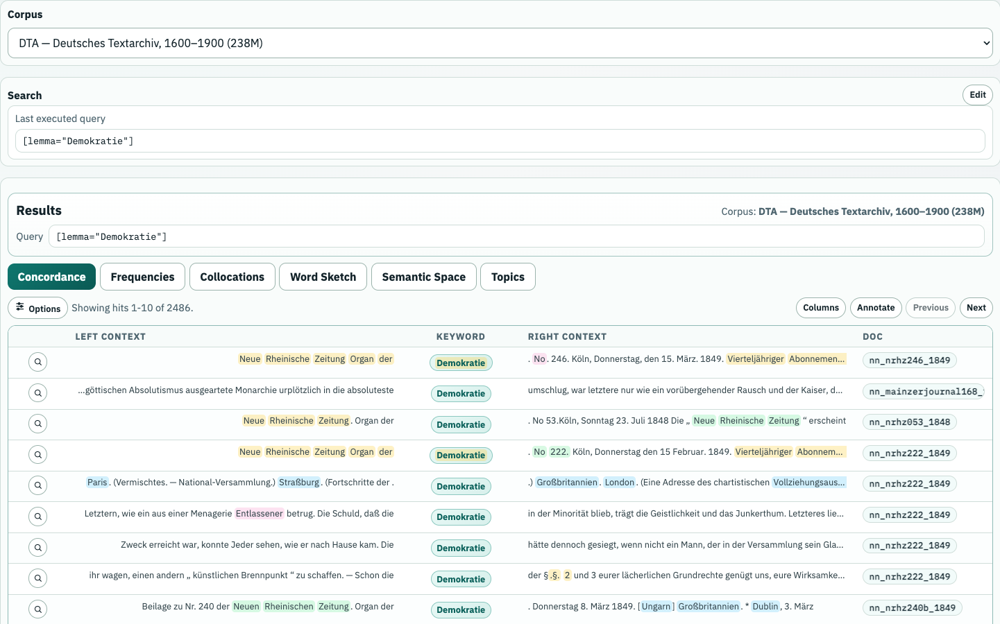
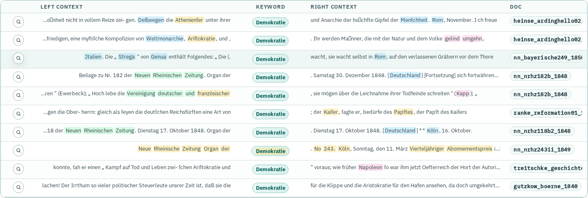
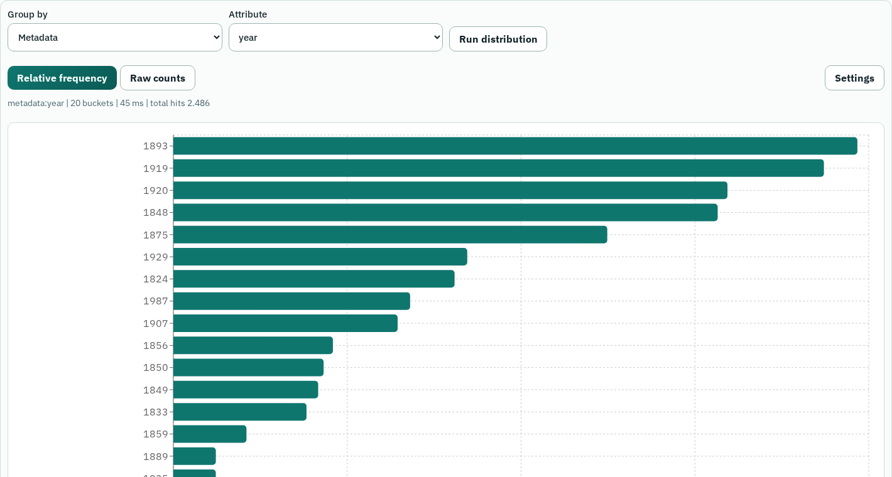
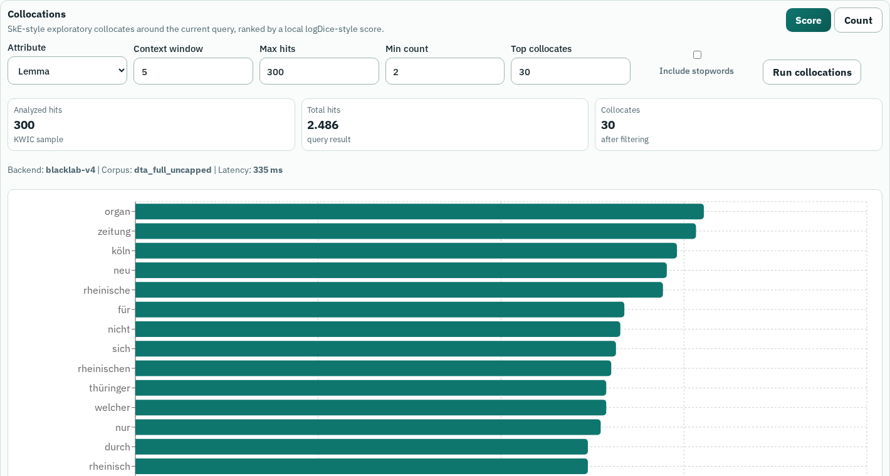

## TextLab in den Digital Humanities {#title-slide .custom-title-slide background-color="#eef4f8"}

::: {.notes}
0-2
:::

Ringvorlesung Digital Humanities · LMU · Sommersemester 2026

Quirin Würschinger · LMU München · 11. Mai 2026

q.wuerschinger@lmu.de

## Zwei Leitfragen

::: {.notes}
2-4
:::

::: {.question-pair}
::: {.question-card .fragment}
### Methodisch

Was kann man mit großen, annotierten Textsammlungen sehen und tun?
:::

::: {.question-card .fragment}
### Infrastrukturell

Welche Infrastruktur macht diese Methoden als Workflow nutzbar?
:::
:::

::: {.callout-fragment .question-summary .fragment}
TextLab ist heute zugleich Werkzeug, Fallbeispiel und Blick in eine DH-Infrastruktur.
:::

## Heute: sechs Dinge, die TextLab zeigt

::: {.notes}
4-6
:::

::: {.demo-palette}
::: {.demo-card .fragment}
**1 Belege öffnen** 
KWIC, Kontext, Dokumentdetails
:::

::: {.demo-card .fragment}
**2 Verteilungen sehen** 
Jahr, Genre, Subreddit, Texttyp
:::

::: {.demo-card .fragment}
**3 Nachbarschaften finden** 
Kollokationen und Beispielkontexte
:::

::: {.demo-card .fragment}
**4 grammatische Profile bauen** 
Word Sketches aus Annotationen
:::

::: {.demo-card .fragment}
**5 semantisch explorieren** 
Embeddings, Cluster, Search
:::

::: {.demo-card .fragment}
**6 Treffer annotieren** 
Labels, LLMs, Review, Export
:::
:::

::: {.callout-fragment .fragment}
Das Motto für morgen: erst zeigen, was möglich ist; danach erklären, welche Daten- und Softwareentscheidungen das möglich machen.
:::

## Was ist TextLab?

::: {.notes}
6-8
:::

::: {.tool-facts}
::: {.tool-fact .fragment}
**Arbeitsumgebung** 
Suche, KWIC, Frequenzen, Kollokationen, Word Sketches, semantische Suche und Annotation.
:::

::: {.tool-fact .fragment}
**Infrastruktur** 
React-Frontend, FastAPI-Backend, BlackLab-Indizes, Analysejobs und Registry-Konfiguration.
:::

::: {.tool-fact .fragment}
**Methode** 
Dieselben Daten lassen sich als KWIC, Zeitreihe, Kollokationsprofil, semantischer Raum oder Label-Set betrachten.
:::
:::

::: {.callout-fragment .fragment}
TextLab ist interessant, weil Datenmodellierung und Analysewerkzeuge in einer Oberfläche zusammenkommen.
:::

## Korpuslinguistik als Werkzeugkasten

::: {.notes}
8-10
:::

::: {.method-detail}
::: {.detail-panel}

Gegenstand

Empirische Sprach- und Textanalyse auf der Basis dokumentierter, maschinenlesbarer Textsammlungen.
:::

::: {.detail-panel}

Prinzip

Einzelbelege und quantitative Muster werden zusammen gelesen: Konkordanz, Frequenz, Kollokation, Variation.
:::

::: {.example-panel}

DH-Perspektive

Korpora sind keine Rohdaten, sondern modellierte Quellen: Auswahl, Metadaten, Annotation und Interface prägen jedes Resultat.
:::
:::

::: {.caption-note}
Grundlagen: @sinclair1991; @biberConradReppen1998; @mceneryHardie2011; angewandte Perspektive: @hunston2002.
:::

## Was kann man damit machen?

::: {.notes}
8-10
:::

::: {.tool-facts}
::: {.tool-fact .fragment}
**Belege öffnen** 
Aus einer Query werden sofort KWIC-Zeilen, Detailansichten und zitierbare Beispiele.
:::

::: {.tool-fact .fragment}
**Muster vergleichen** 
Treffer lassen sich nach Zeit, Genre, Register, Region oder Community gruppieren und visualisieren.
:::

::: {.tool-fact .fragment}
**Module kombinieren** 
Frequency, Collocations, Word Sketches, Semantic Search, Annotation und LLMs bauen auf demselben Trefferraum auf.
:::
:::

::: {.callout-fragment .fragment}
Heute geht es um Bandbreite: Daten ausprobieren, Muster sichtbar machen und verstehen, wie die Tools dafür gebaut sind.
:::

## Modulpalette: derselbe Trefferraum

::: {.notes}
10-12
:::

::: {.workflow .core-workflow}
::: {.workflow-step .fragment}
**Concordance** 
KWIC lesen 
Bedeutung entsteht im Kontext.
:::

::: {.workflow-step .fragment}
**Frequency** 
zählen und gruppieren 
Frequenz ist corpus-relativ.
:::

::: {.workflow-step .fragment}
**Collocation** 
Nachbarschaften finden 
Wörter haben typische Umgebungen.
:::

::: {.workflow-step .fragment}
**Annotation** 
Merkmale hinzufügen 
POS, Lemma, Dependency, Labels.
:::

::: {.workflow-step .is-dark .fragment}
**Workflow** 
kombinieren 
Suche + Vergleich + Modell.
:::
:::

::: {.caption-note}
Zu Konkordanz/Kollokation: @sinclair1991; zu Frequenz und Statistik: @mceneryHardie2011; @brezina2018.
:::

## 90 Minuten

::: {.notes}
12-14
:::

::: {.schedule-grid}
::: {.schedule-session}

Block 1 · Korpora, Suche, Muster

::: {.schedule-items}
::: {.schedule-item}
0-10 **Einstieg** <em>Was kann TextLab live zeigen?</em>
:::
::: {.schedule-item}
10-25 **Daten + Infrastruktur** <em>Warum Korpora und Registry die Module tragen.</em>
:::
::: {.schedule-item}
25-45 **Live-Demo** <em>DTA: Query, KWIC, Frequenz, nächste Frage.</em>
:::
::: {.schedule-item .is-main}
45-60 **Hands-on** <em>Dieselbe Pipeline selbst nachvollziehen.</em>
:::
:::
:::

::: {.schedule-session}

Block 2 · Vergleich, Exploration, Modellierung

::: {.schedule-items}
::: {.schedule-item}
60-70 **Kontrast** <em>Reddit, Plattformdaten, Subreddit-Verteilungen.</em>
:::
::: {.schedule-item}
70-80 **Module** <em>Kollokationen, Word Sketches, Semantik, LLMs.</em>
:::
::: {.schedule-item .is-main}
80-90 **Hands-on + Diskussion** <em>Eigene Query + Modul ausprobieren.</em>
:::
:::
:::
:::

::: {.caption-note}
Regel für Montag: DTA ist der gemeinsame Startpunkt; Reddit, COHA und KI-Module zeigen die methodische Bandbreite.
:::

## Kernpfad: aus einer Query wird mehr

::: {.notes}
8-10
:::

::: {.workflow .core-workflow}
::: {.workflow-step .is-dark .fragment}
**1** 
Suchraum bauen 
Korpus + Query + Filter
:::

::: {.workflow-step .fragment}
**2** 
Belege öffnen 
KWIC, Detail, Dokument
:::

::: {.workflow-step .fragment}
**3** 
Muster sichtbar machen 
Jahr, Genre, Subreddit
:::

::: {.workflow-step .fragment}
**4** 
Module wechseln 
Collocation, Sketch, Semantic
:::

::: {.workflow-step .is-dark .fragment}
**5** 
Anschlussfrage finden 
vergleichen, annotieren, modellieren
:::
:::

## Demo-Thread

::: {.notes}
10-12
:::

::: {.case-thread}
::: {.case-card .fragment}
### Query

`[lemma="Demokratie"]`
:::

::: {.case-card .fragment}
### Muster

Die Treffer clustern stark um 1848.
:::

::: {.case-card .fragment}
### Frage

Welche nächste Analyse wird daraus: Genre, KWIC, Kollokation oder Vergleichslemma?
:::
:::

## Ein Korpus ist ein Datenprodukt

::: {.notes}
14-16
:::

::: {.source-criticism}
::: {.source-question .fragment}
**Text**

Was wurde gesammelt, transkribiert, normalisiert und segmentiert?
:::

::: {.source-question .fragment}
**Metadaten**

Welche Kategorien ordnen das Material, bevor wir es durchsuchen?
:::

::: {.source-question .fragment}
**Annotation**

Welche Tokens, Lemmas, POS-Tags, Dependencies und Entitäten werden berechnet?
:::

::: {.source-question .fragment}
**Interface**

Welche Resultatansichten machen neue Operationen möglich?
:::
:::

::: {.callout-fragment .fragment}
Der praktische Punkt: Je besser Datenmodell und Annotationen, desto interessanter werden Suche, Module und Demos.
:::

## Wie ist das gebaut?

::: {.notes}
16-18
:::

::: {.architecture-flow}
::: {.architecture-step}
**1 Rohdaten** 
XML, Reddit, PDF, Text
:::

::: {.architecture-arrow}
→
:::

::: {.architecture-step}
**2 Normalisierung** 
Dokumente, Chunks, Metadaten
:::

::: {.architecture-arrow}
→
:::

::: {.architecture-step}
**3 Annotation** 
Token, Lemma, POS, Dep, NER
:::

::: {.architecture-arrow}
→
:::

::: {.architecture-step}
**4 Index** 
BlackLab, BCQL, KWIC, Groups
:::

::: {.architecture-arrow}
→
:::

::: {.architecture-step .is-dark}
**5 TextLab** 
API, UI, Module, Export, Annotation
:::
:::

::: {.registry-strip}
**Corpus Registry:** Labels, Attribute, Werte, Capabilities und bekannte Einschränkungen verbinden Normalisierung, Index und UI.
:::

::: {.caption-note}
Die Registry ergänzt den Index: BlackLab bleibt Quelle für vorhandene Felder; die Registry beschreibt, wie diese Felder sinnvoll genutzt werden.
:::

## Warum Registry? Weil Module Felder brauchen

::: {.notes}
18-20
:::

::: {.translation-strip}
::: {.translation-step .fragment}
**Problem**

Attribute existieren technisch, aber die UI muss wissen, was sie bedeuten.
:::

::: {.translation-step .fragment}
**Ohne Registry**

Query Builder, Korpusauswahl, Doku und QA driften auseinander.
:::

::: {.translation-step .fragment}
**Mit Registry**

`corpora.yml` wird Single Source of Truth für Korpusprofile.
:::

::: {.translation-step .is-dark .fragment}
**Nutzen**

Module können Vorschläge, Labels, Capabilities und bekannte Grenzen direkt aus derselben Quelle ziehen.
:::
:::

## Korpus-Ingestion: aus Daten wird ein Demo-Korpus

::: {.notes}
20-23
:::

::: {.workflow}
::: {.workflow-step .fragment}
**01** 
Herkunft 
Rechte, Sampling, Zeitraum, Sprache
:::

::: {.workflow-step .fragment}
**02** 
Dokumentmodell 
Dokument, Chunk, Satz, Token
:::

::: {.workflow-step .fragment}
**03** 
Metadaten 
Jahr, Quelle, Genre, Subreddit, Typ
:::

::: {.workflow-step .fragment}
**04** 
NLP 
Token, Lemma, POS, Dep, NER
:::

::: {.workflow-step .fragment}
**05** 
Index 
Vertikalformat, BlackLab, Capabilities
:::

::: {.workflow-step .is-dark .fragment}
**06** 
Registry 
Felder, Werte, Labels, Limits
:::
:::

## Demo-Korpora

::: {.notes}
23-25
:::

| Korpus | Größe | Wofür heute gut? | Live-Idee |
|---|---:|---|---|
| DTA | 238.3M Tokens | historisches Deutsch, diachrone Muster, KWIC, Frequency, Word Sketch | `Demokratie`, `Freiheit`, Varianten nach Jahr |
| COHA | 469.9M Tokens | historisches Englisch, Genres, lexikalischer Wandel | `computer`, `radio`, `automobile` nach Dekade |
| German Reddit | 61.2M Tokens | Plattformkommunikation, Subreddits, Gegenwartssprache | `deutsch` nach Subreddit |
| English Reddit | 41.3M Tokens | regionale Communities, Subreddit-Kontrast | `Wales` nach Community |

::: {.caption-note}
Im UI werden Tokenzahlen angezeigt; Trefferzahlen entstehen erst aus Korpus + Query + Filter.
:::

## Zugang und Demo-Regel

::: {.notes}
25
:::

<h3>Live</h3>

<ul>
<li><a href="https://www.wuerschinger.org/textlab/">https://www.wuerschinger.org/textlab/</a></li>
<li>Zugangsdaten stehen im Raum an der Tafel</li>
<li>zuerst DTA, dann erst Reddit</li>
</ul>

<h3>Fallback</h3>

<ul>
<li>Screenshots zeigen dieselben Schritte</li>
<li>bei WLAN/Auth-Problemen gemeinsam vorne durchgehen</li>
<li>Aufgabe bleibt: Query, Muster, Modulwechsel, nächste Frage</li>
</ul>

## Teil 1: Von Query zu Muster {.section-slide}

::: {.notes}
25
:::

::: {.section-question}
Was kann man aus einer Suchanfrage alles machen?
:::

## Von Begriff zu Query

::: {.notes}
25-27
:::

::: {.operationalization-grid}
::: {.concept-box .fragment}
### Konzept

Demokratie als politischer, historischer und semantisch mehrdeutiger Begriff.
:::

::: {.arrow-box .fragment}
→
:::

::: {.query-box .fragment}
### Operationalisierung

`[lemma="Demokratie"]`

ein Suchweg, nicht der Begriff selbst.
:::

::: {.arrow-box .fragment}
→
:::

::: {.evidence-box .fragment}
### Suchraum

Treffer, KWIC-Kontexte, Jahre, Genres, Communities.
:::
:::

## Query-Syntax

::: {.notes}
27-29
:::

Wir nutzen einfache BlackLab/BCQL-Queries:

::: {.query-examples}
`[lemma="Demokratie"]`

`[lemma="Freiheit"]`

`[word="Teutsch.*"]`
:::

::: {.syntax-reference}
`lemma` gruppiert flektierte Formen. `word` sucht konkrete Wortformen. `.*` erweitert die Suche regulär. Jede Erweiterung verändert, was später als Treffer gilt.
:::

## TextLab: Query Setup

::: {.notes}
29-30
:::

Korpus, Query und Suchmodus bestimmen, welche Muster sichtbar werden.

## Concordance / KWIC

::: {.notes}
30-32
:::

::: {.method-detail}
::: {.detail-panel}

Was kann man damit machen?

Viele Fundstellen schnell scannen, typische Kontexte finden und interessante Beispiele öffnen.
:::

::: {.detail-panel}

Technisch

BlackLab liefert Tokenkontext, Annotationen und Dokumentmetadaten; TextLab macht daraus KWIC-Zeilen, Details, Export und Annotation Targets.
:::

::: {.example-panel}

DTA-Beispiel

`[lemma="Demokratie"]`: politische Argumente, Zeitungskontexte, metasprachliche Verwendungen und Zeitverläufe werden gemeinsam sichtbar.
:::
:::

::: {.callout-fragment .fragment}
Eine Trefferliste ist ein Einstiegspunkt: von dort aus geht es zu Frequenzen, Kollokationen, Annotation und Modellen.
:::

## Concordance-Beispiel

::: {.notes}
32-33
:::

KWIC macht auf einen Blick sichtbar, in welchen Formulierungen und Dokumenttypen ein Treffer vorkommt.

## Schnell weiterdrehen

::: {.notes}
33-35
:::

::: {.truth-grid}
::: {.truth-card .fragment}
**Guter Treffer** 
Beleg öffnen
:::

::: {.truth-card .fragment}
**Auffälliges Muster** 
gruppieren oder zählen
:::

::: {.truth-card .fragment}
**Nächste Query** 
Variante testen
:::
:::

::: {.reading-standard .fragment}
Ein kurzer KWIC-Scan reicht oft, um danach schnell in Frequency, Collocations oder Word Sketches weiterzugehen.
:::

## Frequency

::: {.notes}
35-37
:::

::: {.method-detail}
::: {.detail-panel}

Was kann man damit machen?

Treffer nach Jahr, Genre, Textklasse, Subreddit, POS, NER oder anderen Feldern gruppieren.
:::

::: {.detail-panel}

Technisch

TextLab ruft BlackLab-Gruppierungen oder abgeleitete Distributionen ab: Buckets, Trefferzahlen, Dokumentzahlen und Normalisierung.
:::

::: {.example-panel}

DTA-Beispiel

Der Peak um 1848 macht historische Dynamik sofort sichtbar und lädt zu weiteren Gruppierungen ein.
:::
:::

## Beispiel: Demokratie nach Jahr

::: {.notes}
37-39
:::

::: {.bar-chart .chronology-chart}
::: {.bar-row .fragment}
18481252
:::

::: {.bar-row .fragment}
1893174
:::

::: {.bar-row .fragment}
1875125
:::

::: {.bar-row .fragment}
1856100
:::

::: {.bar-row .fragment}
185090
:::
:::

::: {.callout-fragment .fragment}
Nächste Klicks: Genre vergleichen, einzelne Jahre öffnen, andere Lemmata testen.
:::

## Frequency-Beispiel im UI

::: {.notes}
39-40
:::

Aus einer Query wird eine Zeitreihe; aus der Zeitreihe entstehen neue Vergleichsfragen.

## Live-Demo 1: DTA

::: {.notes}
40-45
:::

::: {.exercise-brief}
::: {.exercise-main}
**Startpfad**

`dta_full_uncapped` · `[lemma="Demokratie"]`
:::

::: {.exercise-steps}
1. Query ausführen und Trefferzahl notieren: ca. `2.486`. 
2. Zwei KWIC-Zeilen lesen: Was ist der Treffer? 
3. Frequency nach `year`: Peak `1848`. 
4. Optional: Genre, Collocations oder eine zweite Query ausprobieren.
:::
:::

::: {.status-note}
Sprechspur: Eine Query kann nacheinander als KWIC, Zeitreihe, Vergleich und Explorationspfad genutzt werden.
:::

## Hands-on 1

::: {.notes}
45-60
:::

::: {.exercise-brief}
::: {.exercise-main}
**Output**

Eine kleine Exploration zu einer DTA-Query.
:::

::: {.exercise-steps}
1. Korpus: `dta_full_uncapped` 
2. Query: `[lemma="Demokratie"]` oder `[lemma="Freiheit"]` 
3. KWIC kurz scannen 
4. Frequency nach `year` anschauen 
5. eine Anschlussfrage notieren: anderes Lemma, Genre, Kollokation?
:::
:::

## Teil 2: Von Muster zu Modell {.section-slide}

::: {.notes}
60
:::

::: {.section-question}
Was passiert, wenn wir vergleichen, explorieren und modellgestützt klassifizieren?
:::

## Reddit als Kontrast

::: {.notes}
60-63
:::

::: {.question-pair}
::: {.question-card .fragment}
### DTA

- historischer Korpus-Snapshot
- Werk- und Editionslogik
- diachrone Verteilungen
- Begriffsgeschichte, Medienwandel, Register
:::

::: {.question-card .fragment}
### Reddit

- Plattform- und Community-Daten
- Subreddit- und Moderationslogik
- Gegenwartssprache, Meme- und Kommentarformate
- Community-Kontraste und Alltagssprache
:::
:::

## Reddit-Livedemo

::: {.notes}
63-68
:::

::: {.exercise-brief}
::: {.exercise-main}
**Deutsch**

`German Reddit` · `[lemma="deutsch"]` · Group by `subreddit`

Smoke-Wert: `33.122` Treffer; Top: `de`, `ich_iel`, `FragReddit`.
:::

::: {.exercise-steps}
**Englisch**

`English Reddit` · `[word="Wales"]` · Group by `subreddit`

Smoke-Wert: `46.003` Treffer; Top: `Wales`, `Scotland`, `AskUK`.
:::
:::

::: {.warning-card}
Reddit ist methodisch interessant, weil Sprache hier an Communities, Plattformregeln, Meme-Formate und Moderation gekoppelt ist.
:::

## Beispielpalette

::: {.notes}
68-70
:::

::: {.tool-facts}
::: {.tool-fact .fragment}
**DTA** 
`[lemma="Demokratie"]`, `[lemma="Freiheit"]`, `[word="Teutsch.*"]` nach Jahr.
:::

::: {.tool-fact .fragment}
**COHA** 
`[lemma="computer"]`, `[lemma="radio"]`, `[lemma="automobile"]` nach Dekade und Genre.
:::

::: {.tool-fact .fragment}
**Reddit** 
`[lemma="deutsch"]`, `[word="Wales"]`, Community-Vergleiche nach Subreddit.
:::
:::

::: {.caption-note}
Die Vorlesung muss nicht jede Query ausinterpretieren; wichtiger ist die Bandbreite der Analyseoperationen.
:::

## COHA als Brückenkorpus {#coha-bridge}

::: {.notes}
70-72
:::

<h3>Warum interessant?</h3>

<ul>
<li>historisches Englisch von 1810 bis 2010er Jahre</li>
<li>Genres: Fiction, Magazine, Newspaper, Non-fiction</li>
<li>lemmatisiert und POS-getaggt</li>
<li>gute Brücke zwischen DTA und Gegenwartskorpora</li>
</ul>

<h3>Demo-Ideen</h3>

<ul>
<li><code>[lemma="computer"]</code>: Aufstieg ab den 1960/70ern</li>
<li><code>[lemma="radio"]</code>: Mediengeschichte im 20. Jahrhundert</li>
<li><code>[lemma="automobile"]</code> vs. <code>[lemma="car"]</code>: lexikalische Konkurrenz</li>
<li>Gruppierung nach <code>year</code>, <code>decade</code> oder <code>genre</code></li>
</ul>

::: {.caption-note}
Guter Didaktikpunkt: Bei `computer` sieht man lexikalischen Wandel und ältere Personenbedeutungen sehr schnell im selben Workflow.
:::

## Kollokationen

::: {.notes}
72-74
:::

::: {.method-detail}
::: {.detail-panel}

Was kann man damit machen?

Typische lexikalische Nachbarschaften eines Suchtreffers explorieren.
:::

::: {.detail-panel}

Technisch

TextLab zählt Kandidaten in KWIC-Fenstern oder Indexgruppen und sortiert nach Frequenz oder Assoziationsscore.
:::

::: {.example-panel}

Parameter

Fenstergröße, Mindestfrequenz, Lemma/Wortform und Score steuern, welche Nachbarschaften sichtbar werden.
:::
:::

## Collocation-Beispiel

::: {.notes}
74
:::

Kollokationen machen typische sprachliche Umgebungen sichtbar und liefern sofort neue Suchideen.

## Word Sketches

::: {.notes}
74-76
:::

::: {.method-detail}
::: {.detail-panel}

Was kann man damit machen?

Grammatische Umgebungen eines Lemmas zusammenfassen: Modifikatoren, Verben, nominale Partner, Präpositionen.
:::

::: {.detail-panel}

Technisch

Dependency-Annotationen werden zu Relationengruppen verdichtet; Ergebnisse sind explorative Kandidaten.
:::

::: {.example-panel}

Demo-Idee

Ein Lemma wird zu einer kleinen Karte typischer Subjekt-, Objekt- und Modifikatorbeziehungen.
:::
:::

## Word-Sketch-Beispiel

::: {.notes}
72
:::

Word Sketches verdichten viele Treffer zu Relationstypen und Beispielpfaden.

## Semantische Module

::: {.notes}
72-75
:::

::: {.outlook-grid}
::: {.outlook-card .is-ready .fragment}
### Semantic Analysis

KWIC-Kontexte werden als Embeddings repräsentiert, geclustert und projiziert.
:::

::: {.outlook-card .fragment}
### Semantic Search

Eine Frage wird eingebettet; TextLab sucht semantisch ähnliche Segmente im RAG-Index.
:::

::: {.outlook-card .fragment}
### LLM Classification

Ein Labelschema wird auf Treffer, Passagen oder Dokumente angewendet: Genre, Position, Haltung, Thema.
:::

::: {.outlook-card .fragment}
### Annotation

Manuelle und assistierte Labels machen Suchergebnisse zu Trainings- und Vergleichsdaten.
:::
:::

::: {.callout-fragment .fragment}
Der interessante DH-Punkt: dieselben Korpora können zugleich Suchindex, Statistikbasis, Embedding-Raum und Annotationsdatenbank sein.
:::

## Annotation und LLMs

::: {.notes}
75
:::

Annotation macht aus Treffern strukturierte Daten: Labels, Beispiele, Review und später Vergleichbarkeit.

## Suche als reproduzierbare Pipeline

::: {.notes}
75-77
:::

::: {.pipeline-flow}
::: {.pipeline-step .fragment}
**1 Text types** 
Korpus/Filter festlegen
:::

::: {.pipeline-step .fragment}
**2 Query** 
Trefferraum erzeugen
:::

::: {.pipeline-step .fragment}
**3 Sample / Sort** 
Auswahl und Ansicht dokumentieren
:::

::: {.pipeline-step .fragment}
**4 Analysis** 
KWIC, Frequency, Collocation, Label
:::
:::

::: {.callout-fragment .fragment}
Perspektive für TextLab: Such- und Analyseoperationen sollten als sichtbare, reproduzierbare Schrittfolge speicherbar werden.
:::

## Von Demo zu Anschlussfrage

::: {.notes}
77-80
:::

::: {.finding-compare .finding-compare-3}
::: {.weak-finding .fragment}
### Start

`computer` nimmt im 20. Jahrhundert zu.
:::

::: {.better-finding .fragment}
### Demo-tauglich

In COHA zeigt `[lemma="computer"]` frühe Personenbedeutungen und später technische Bedeutungen; nach `decade` sieht man den Bedeutungs- und Technologiewandel.
:::

::: {.researchable-finding .fragment}
### Nächster Schritt

Nächste Schritte: `computer` mit `radio`, `television`, `internet` vergleichen; Genreeffekte prüfen; KWIC-Beispiele als Annotation-Set sammeln.
:::
:::

## Reproduzierbarer Workflow

::: {.notes}
80-82
:::

::: {.documentation-grid}
::: {.documentation-card .fragment}
**Frage**

Welche Exploration oder Vergleichsfrage?
:::

::: {.documentation-card .fragment}
**Operationalisierung**

Was zählt als Treffer?
:::

::: {.documentation-card .fragment}
**Korpus**

Welche Version, Felder, Größe?
:::

::: {.documentation-card .fragment}
**Modul**

KWIC, Frequency, Collocation, Sketch, Semantic, LLM?
:::

::: {.documentation-card .fragment}
**Output**

Screenshot, Query, Tabelle, Label-Set, nächste Frage?
:::
:::

## Referenzpunkte

::: {.notes}
80-82
:::

::: {.resource-list}
::: {.fragment}
**Korpuslinguistische Methode:** @sinclair1991; @biberConradReppen1998; @mceneryHardie2011
:::

::: {.fragment}
**Anwendung und Statistik:** @hunston2002; @brezina2018
:::

::: {.fragment}
**Historische Korpora und COHA:** @davies2012coha
:::

::: {.fragment}
**DH-Datenkritik:** @drucker2011; @schoch2013
:::
:::

## Hands-on 2

::: {.notes}
82-88
:::

::: {.exercise-brief}
::: {.exercise-main}
**Output**

Eine kleine Demo-Karte zu einer Query oder einem Modul.
:::

::: {.exercise-steps}
1. DTA, COHA oder Reddit wählen 
2. Query und Gruppierung notieren 
3. ein Modul ausprobieren: Frequency, Collocation oder Word Sketch 
4. ein auffälliges Muster oder Beispiel festhalten 
5. eine Anschlussfrage formulieren
:::
:::

## Mini-Aussage: Vorlage

::: {.notes}
82-88
:::

::: {.template-card}
In Korpus **X** liefert Query **Y** mit Modul **Z** ein interessantes Muster: **...**

Ein Beispiel oder Bucket ist: **...**

Als nächstes würde ich testen: **...**
:::

## Plan B

::: {.notes}
88-89
:::

Wenn TextLab oder das Netzwerk instabil ist:

::: {.incremental}
- Screenshots zeigen die Hauptschritte.
- Die Live-Demo wird vorne gemeinsam durchgesprochen.
- Die methodische Aufgabe bleibt unverändert.
:::

::: {.callout-fragment}
Tools sind austauschbar; entscheidend ist die transparente Analyseoperation.
:::

## Literatur {.smaller}

::: {.notes}
Backup
:::

::: {#refs}
:::

## Montag-Checkliste

::: {.notes}
Vor der Sitzung
:::

::: {.checkpoint-list}
- TextLab öffnen und Login mit dem Vorlesungsaccount testen.
- DTA: `[lemma="Demokratie"]` → KWIC → Frequency by `year` → ca. `2.486` Treffer.
- German Reddit: `[lemma="deutsch"]` → Frequency by `subreddit` → ca. `33.122` Treffer.
- English Reddit: `[word="Wales"]` → Frequency by `subreddit` → ca. `46.003` Treffer.
- Word Sketch/Collocations nur zeigen, wenn der DTA-Pfad stabil läuft.
- Semantic Search/LLM als Methodenblick, nicht als Live-Abhängigkeit.
:::

## Schluss

::: {.notes}
89-90
:::

TextLab zeigt, wie aus Korpora konkrete Analysewege werden: suchen, vergleichen, verdichten, annotieren und mit Modellen weiterarbeiten.

::: {.takeaway}
Der Gewinn liegt in der Kombination: gute Korpora, sichtbare Workflows und Module, die aus Treffern neue Fragen machen.
:::

## Takeaway

::: {.notes}
90
:::

::: {.takeaway-lines}
::: {}
Daten wählen.
:::

::: {}
Query starten.
:::

::: {}
Module kombinieren.
:::
:::
